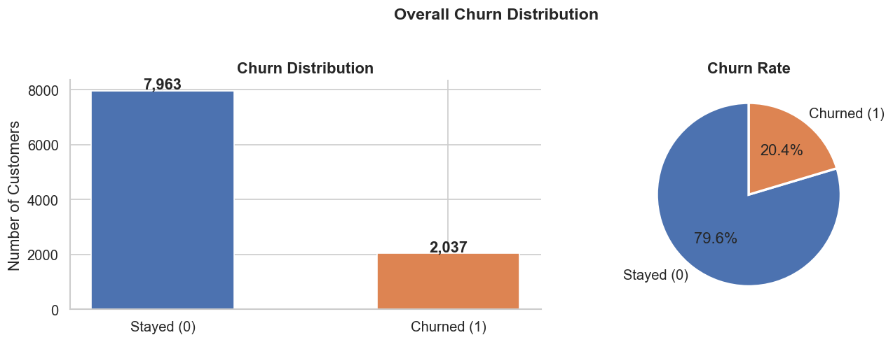
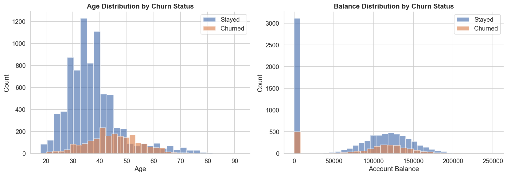
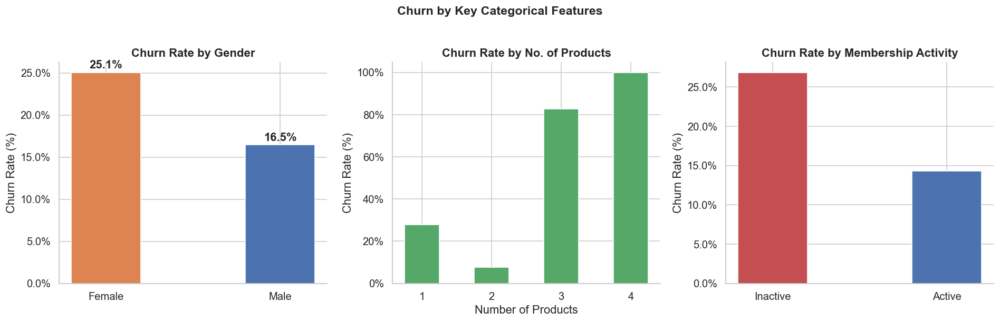
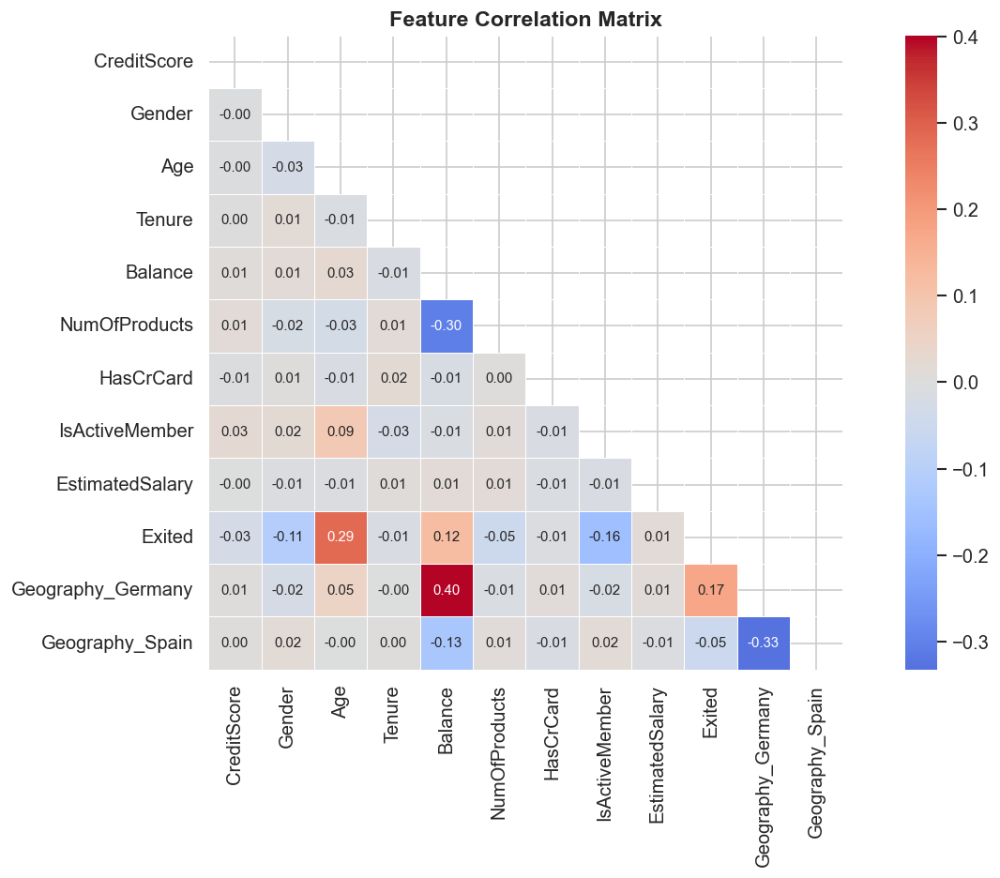
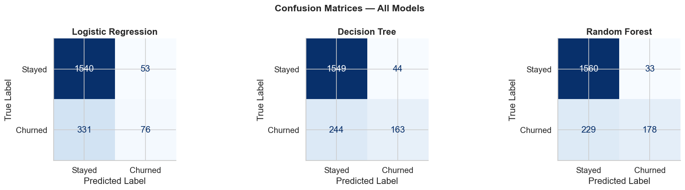
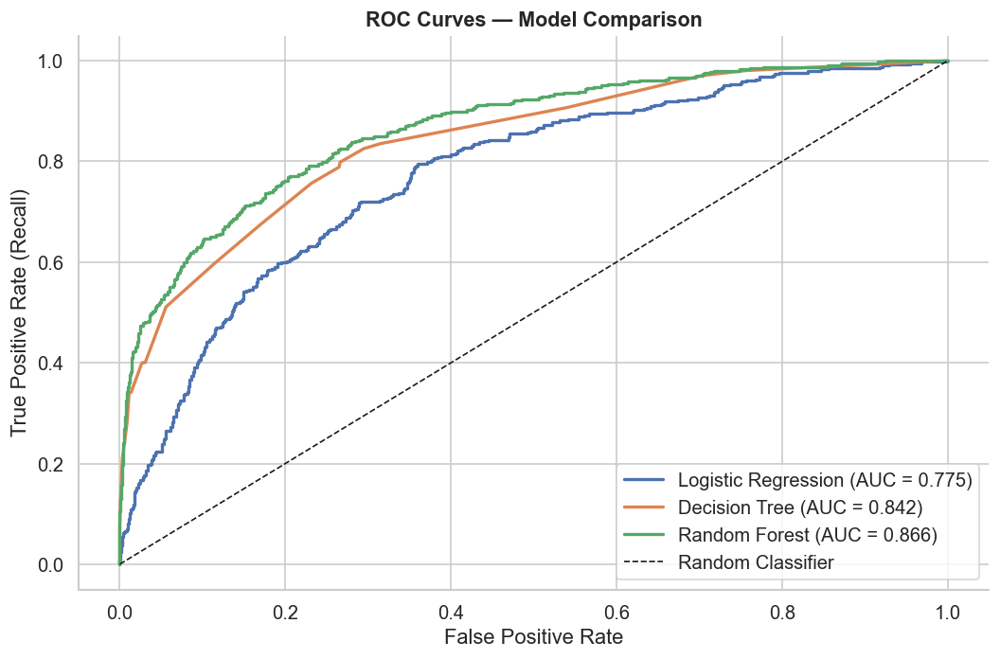
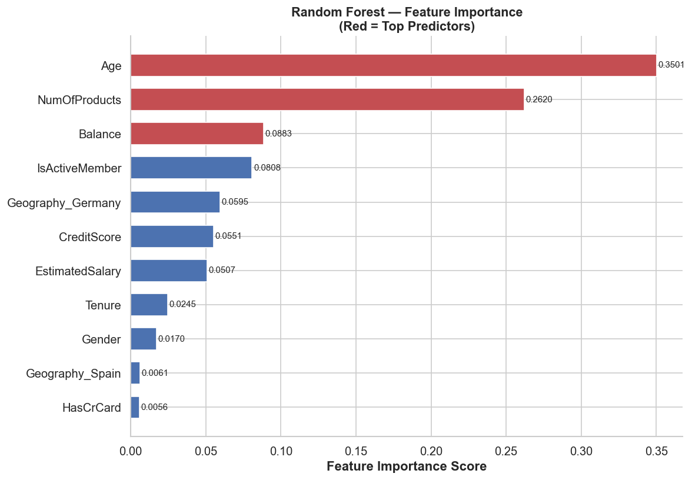

# Customer Churn Prediction

Banks lose customers every day. Most of them do not know it is happening until it is too late. Replacing a lost customer costs 5 to 7 times more than keeping one, yet most retention efforts are reactive. A customer leaves and only then does the bank try to win them back. This project flips that around. The goal was to build a model that flags at-risk customers before they leave so the bank can act first.

---

## The Problem

Out of 10,000 bank customers in this dataset, 2,037 had already churned. That is a 20.4% churn rate.

That is 1 in 5 customers walking out the door. Without a way to predict who is next, retention budgets get spread thin across everyone instead of focused on the customers who actually need attention.

---

## The Data

**Source:** Churn Modelling Dataset, Kaggle
**Size:** 10,000 customer records, 13 features
**Target variable:** Exited. 1 if the customer churned, 0 if they stayed.

Features included age, account balance, number of products, geography, credit score, membership activity, and estimated salary.

---

## What I Did

**1. Cleaned the data**
Checked for missing values and duplicates. Encoded categorical variables like geography and gender using label encoding so the models could process them.

**2. Explored the data**
Before building anything I wanted to understand what the data was actually saying. A few patterns stood out immediately.

Churn was heavily concentrated in the 40 to 60 age group. Younger customers mostly stayed. High-balance customers churned more than lower-balance ones, which suggests customers with more options elsewhere are quicker to leave.

Female customers churned at 25.1% versus 16.5% for male customers. Customers holding 2 products were the most loyal with a churn rate under 10%, while customers holding 3 or 4 products churned at 82% and nearly 100% respectively. That pattern suggests over-selling products actually backfires. Inactive members churned at almost double the rate of active ones.

The correlation heatmap confirmed age as the most correlated single feature with churn at 0.29, followed by balance at 0.12 and active membership at -0.16.

**3. Trained three models**
I trained Logistic Regression, Decision Tree, and Random Forest classifiers using an 80/20 train-test split.

**4. Evaluated the models**
Each model was evaluated on accuracy, ROC-AUC score, and confusion matrix to see not just how often it was right but how well it handled the minority class, meaning churned customers specifically.

---

## Results

| Model | Accuracy | ROC-AUC |
|---|---|---|
| Logistic Regression | 80.80% | 0.775 |
| Decision Tree | 85.60% | 0.842 |
| **Random Forest** | **86.90%** | **0.866** |

Random Forest came out on top across both metrics. Looking at the confusion matrices, it also caught more churned customers correctly. 178 true positives versus 163 for Decision Tree and just 76 for Logistic Regression. In a retention context that matters more than overall accuracy because missing a churner is more costly than a false alarm.

The ROC curves make the gap between models visible. Random Forest stays above the other two across the full range of thresholds.

**Feature importance from the Random Forest model:**

Age accounted for 35% of the model's predictive power. Number of products came second at 26%. Balance, active membership status, and geography rounded out the top five.

---

## What the Model Tells the Bank

Three customer segments carry the most churn risk and should be prioritized in any retention campaign:

- Customers aged 40 to 60, especially those in Germany
- Customers holding 3 or 4 products. Counter-intuitively, more products means higher churn, not lower.
- Inactive members with high account balances. They have money and they are disengaged, which means they are likely already looking elsewhere.

Knowing this in advance lets a retention team send targeted offers or schedule outreach before the customer makes a decision, not after.

---

## Tech Stack

Python, pandas, NumPy, scikit-learn, matplotlib, seaborn

---

## Author

**Aiman Ishaq**
CS Student | Data Science & Analytics Intern, Developers Hub Corporation
[LinkedIn](https://linkedin.com/in/aiman-ishaq) . [GitHub](https://github.com/aiman-ami)
